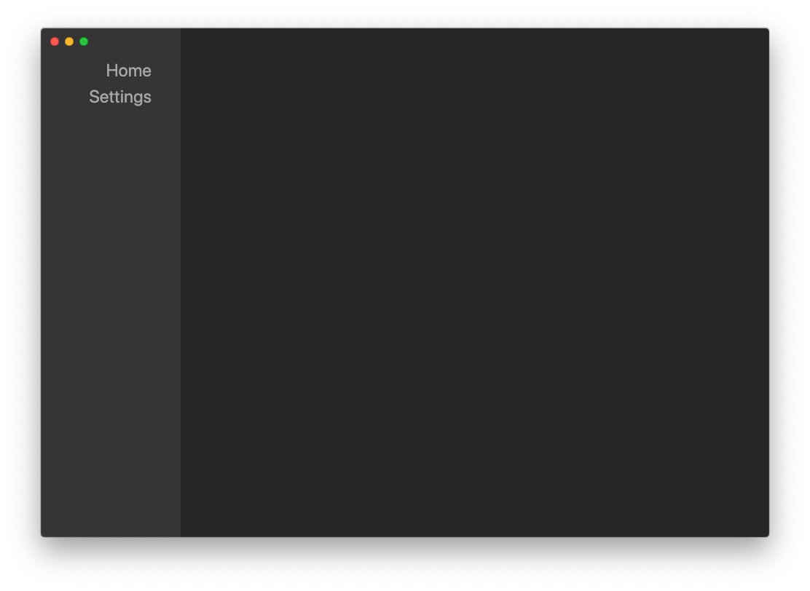
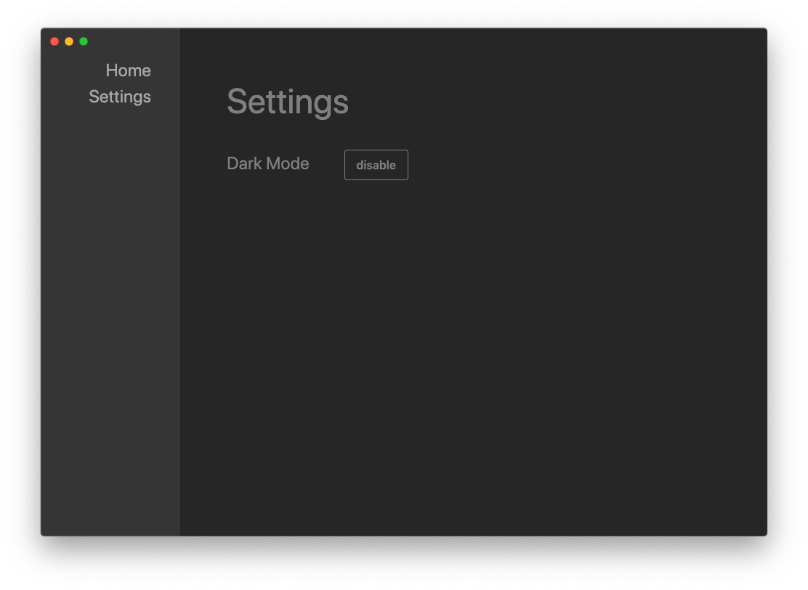

# Electron with Vue Base App
My electron with vue base app for personal projects and further builds. The main functionality is combining the electron & vue front end with a flask backend for python scripts and classes.

## ToDo

- Export with Python as backend
- Implement C++ functionalities
- Enhance Python communication capabilities

## Most Important Used Packages

- Electron
- Electron-Packager
- Vue
- Vue-Router
- Vuex
- Tailwindcss
- Flask
- Python-shell
- Jquery

## Packaging for Export

Note: An automatic creation is done by running the compiling.sh file.

1. Run "pyinstaller server.py" in the logic/python directory to build python for deployment
2. Run "npm run electron:build"